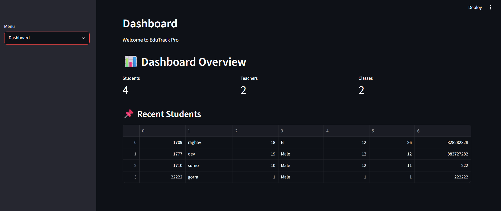
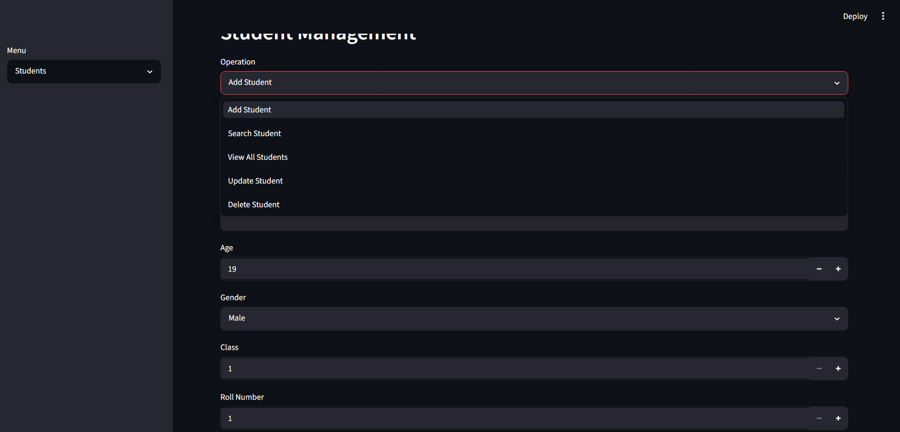
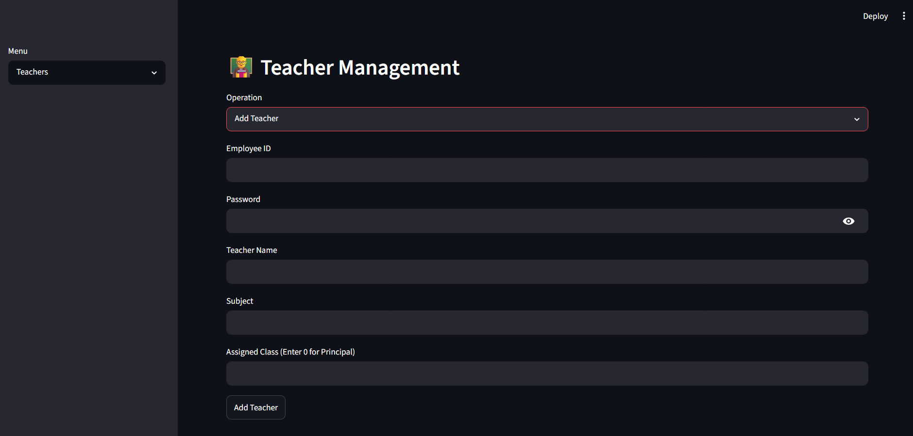
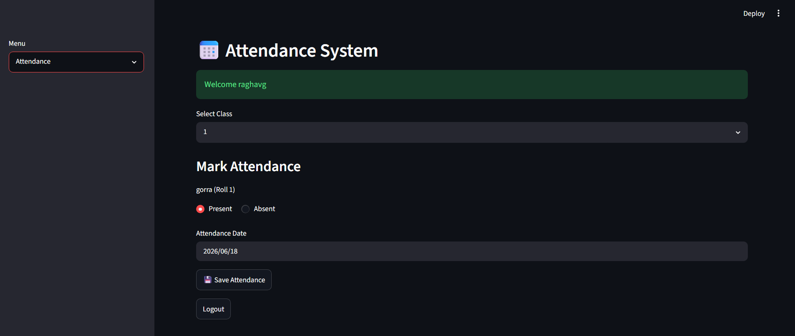
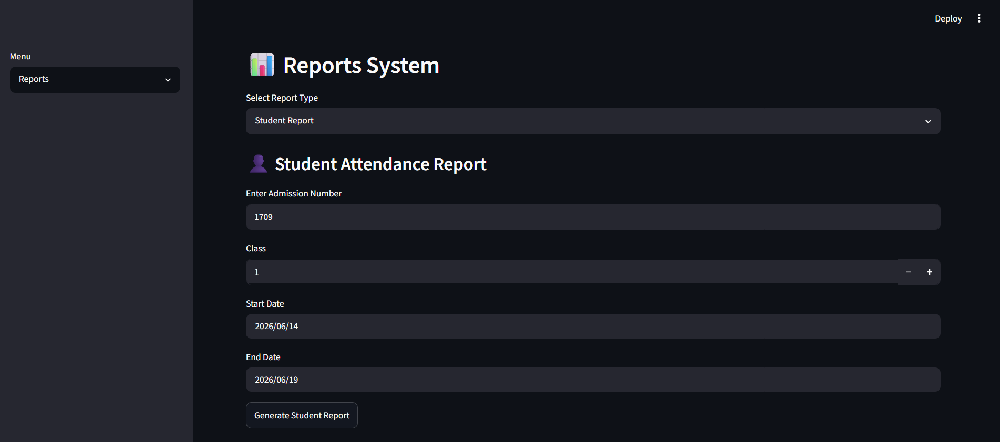

# 📚 EduTrack Pro - School Management System

A simple School Management System built using **Python**, **Streamlit**, and **Pandas**.

This is my beginner Python project created to practice file handling, data management, and building interactive web applications with Streamlit.

---

## 🚀 Features

### 📊 Dashboard
- Total Students
- Total Teachers
- recently added students

### 👨‍🎓 Student Management
- Add new students
- Search student by Admission Number
- View all students
- Update stydent
- Delete Student

### 👩‍🏫 Teacher Management
- Add new teachers
- View all teachers
- Update teacher
- Delete teacher

### 📝 Attendance Management
- Mark daily attendance using class teacher id and password
- Save attendance records

### Attendance Report
- view class attendance report on certain date
- view a student report and attendance percentage


---

## 🛠️ Technologies Used

- Python
- Streamlit
- Pandas
- CSV Files (Database)

---

## 📂 Project Structure

```text
EduTrack-Pro/
│
├── app.py
├── students.csv
├── teachers.csv
├── requirements.txt
├── README.md
└── .gitignore
```

---

## ▶️ Installation

### Clone the repository

```bash
git clone https://github.com/raghavguglani21/EduTrack-Pro.git
```

### Move into the project folder

```bash
cd EduTrack-Pro
```

### Install dependencies

```bash
pip install -r requirements.txt
```

### Run the application

```bash
streamlit run app.py
```

---

# 📸 Screenshots

## Dashboard



---

## Student Management



---

## Teacher Management



---

## Attendance



---

## Attendance Report



---

# 🎯 Learning Outcomes

During this project I learned:

- Python programming
- File Handling using CSV
- Data manipulation with Pandas
- Building web apps using Streamlit
- Creating interactive forms
- Git & GitHub basics

---

# 🔮 Future Improvements

- Login Authentication
- SQLite/MySQL Database
- Student Fee Management
- Export Reports to PDF
- Email Notifications
- Better UI Design

---

# 👨‍💻 Author

**RAGHAV GUGLANI**

GitHub:
https://github.com/raghavguglani21


---

## 🤖 Note

This project was developed as part of my learning journey. I used AI tools for assistance with the user interface design, debugging, and documentation, while I implemented, tested, and understood the project myself.


⭐ If you like this project, feel free to star the repository.